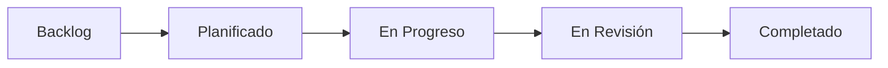

# 🗺️ Roadmap - DedicaFlow

## Visión General

DedicaFlow está en constante evolución para convertirse en la plataforma líder de creación de experiencias audiovisuales interactivas.

---

## ✅ Completado (v0.1.0)

### FASE 1-4: Core Architecture ✅
- [x] Configuración de Next.js 16 con App Router
- [x] Integración completa con Supabase
- [x] Sistema de autenticación
- [x] Panel administrativo base
- [x] Editor visual de tres columnas
- [x] Arquitectura multi-tenancy

### FASE 5: Experience Renderer + Audio ✅
- [x] ExperienceRenderer con React Three Fiber
- [x] Audio Manager con fade in/out
- [x] Control de volumen y loop
- [x] Gestión de estados de reproducción

### FASE 6: Escenas 3D Adicionales ✅
- [x] Nebula (efecto nebulosa con partículas)
- [x] Flowers (flores 3D con múltiples modos)
- [x] PhotoOrbit (fotos orbitando en 3D)

### FASE 7: Media Library ✅
- [x] Integración con Supabase Storage
- [x] Upload de imágenes, videos, audio
- [x] Gestión de assets por proyecto
- [x] Preview de media
- [x] Eliminación de assets

### FASE 8: Sistema de Publicación ✅
- [x] Versionado completo con snapshots
- [x] URLs públicas únicas por slug
- [x] Histórico de publicaciones
- [x] Rollback a versiones anteriores

### FASE 9: Responsive + Performance ✅
- [x] Quality Manager automático
- [x] WebGL fallback system
- [x] Mobile responsive
- [x] Error boundaries
- [x] Prefers-reduced-motion support
- [x] Optimización de bundle

### FASE 10: Testing + Documentación ✅
- [x] Tests unitarios con Vitest
- [x] Tests E2E con Playwright
- [x] Documentación completa
- [x] Deploy preparado para Vercel
- [x] **Repositorio GitHub público**
- [x] **Release v0.1.0 publicada**

---

## 🚧 En Progreso (v0.2.0)

### Q4 2026 - Mejoras de UX y Colaboración

#### Alta Prioridad 🔴
- [ ] **Sistema de Colaboración en Tiempo Real**
  - Edición simultánea de experiencias
  - Cursores de usuarios en tiempo real
  - Chat integrado en el editor
  - Presencia de usuarios online

- [ ] **Modo Oscuro Completo**
  - Toggle de tema
  - Persistencia de preferencia
  - Transiciones suaves
  - Todos los componentes adaptados

- [ ] **Historial de Cambios (Undo/Redo)**
  - Stack de acciones en el editor
  - Atajos de teclado (Ctrl+Z, Ctrl+Y)
  - Indicador visual de cambios

#### Prioridad Media 🟡
- [ ] **Biblioteca de Templates**
  - Templates predefinidos de experiencias
  - Categorización por tipo
  - Preview de templates
  - Importación con un clic

- [ ] **Sistema de Comentarios**
  - Comentarios en escenas específicas
  - Hilos de conversación
  - Notificaciones
  - Resolución de comentarios

- [ ] **Mejoras en Media Library**
  - Carpetas y organización
  - Tags en assets
  - Búsqueda avanzada
  - Filtros por tipo/fecha

---

## 🔮 Planificado (v0.3.0)

### Q1 2027 - Analytics e Integraciones

#### Analytics y Métricas 📊
- [ ] Dashboard de analytics
- [ ] Tracking de vistas de experiencias
- [ ] Tiempo de permanencia
- [ ] Interacciones de usuarios
- [ ] Heatmaps de clics
- [ ] Tasa de completación

#### Integraciones 🔌
- [ ] Integración con Google Analytics
- [ ] Webhooks para eventos
- [ ] API REST pública
- [ ] Exportación de datos
- [ ] Integración con Slack/Discord
- [ ] Zapier/Make.com integration

#### Escenas Nuevas 🎨
- [ ] **Video360**: Videos panorámicos 360°
- [ ] **Timeline**: Línea de tiempo interactiva
- [ ] **Quiz**: Escena de preguntas interactivas
- [ ] **Form**: Formularios personalizados
- [ ] **Map**: Mapa interactivo 3D
- [ ] **Particles**: Sistema de partículas avanzado

---

## 🌟 Futuro (v0.4.0+)

### Q2 2027 - Características Avanzadas

#### AI Integration 🤖
- [ ] Generación de escenas con IA
- [ ] Sugerencias de música automáticas
- [ ] Optimización automática de assets
- [ ] Generación de descripciones
- [ ] Transcripción de audio
- [ ] Subtítulos automáticos

#### Colaboración Avanzada 👥
- [ ] Roles y permisos granulares
- [ ] Aprobación de cambios (workflow)
- [ ] Branching de experiencias
- [ ] Merge de versiones
- [ ] Review system

#### Monetización 💰
- [ ] Planes de suscripción
- [ ] Límites por tier
- [ ] Marketplace de templates
- [ ] Venta de experiencias
- [ ] White-label options

#### Performance 🚀
- [ ] CDN global
- [ ] Caché inteligente
- [ ] Lazy loading avanzado
- [ ] Progressive loading
- [ ] Optimización automática de assets

---

## 🎯 Backlog (Sin Fecha)

### Características Potenciales

#### Editor
- [ ] Atajos de teclado personalizables
- [ ] Modo de vista previa fullscreen
- [ ] Exportación de experiencias
- [ ] Importación desde otras plataformas
- [ ] Versionado de escenas individuales

#### Media
- [ ] Edición básica de imágenes
- [ ] Recorte de videos
- [ ] Conversión automática de formatos
- [ ] Compresión inteligente
- [ ] CDN privado

#### Experiencias
- [ ] Modo presentación (como PowerPoint)
- [ ] Controles de reproducción personalizables
- [ ] Protección con contraseña
- [ ] Fecha de expiración
- [ ] Dominios personalizados

#### Developer Experience
- [ ] API para crear escenas custom
- [ ] SDK de JavaScript
- [ ] CLI para gestión
- [ ] Storybook de componentes
- [ ] Documentación de API completa

#### Internacionalización
- [ ] Soporte multi-idioma en UI
- [ ] Experiencias en múltiples idiomas
- [ ] RTL support
- [ ] Localización de fechas/números

#### Accesibilidad
- [ ] Navegación completa por teclado
- [ ] Screen reader support mejorado
- [ ] Alto contraste
- [ ] Subtítulos en experiencias
- [ ] Audio descripciones

---

## 📝 Notas

### Criterios de Priorización

1. **Impacto en Usuarios**: ¿Beneficia a la mayoría?
2. **Complejidad Técnica**: ¿Es factible implementar?
3. **Dependencias**: ¿Requiere otras features primero?
4. **Valor de Negocio**: ¿Genera valor comercial?
5. **Feedback de Usuarios**: ¿Lo solicitan los usuarios?

### Proceso de Desarrollo



### Cómo Contribuir al Roadmap

1. Revisa los [Issues](https://github.com/boris13jbb/dedica-flow/issues)
2. Busca la etiqueta `enhancement`
3. Comenta en el issue con tu feedback
4. Si no existe, crea un nuevo issue con:
   - Descripción clara de la feature
   - Casos de uso
   - Beneficios esperados
   - Mockups si es posible

---

## 🔄 Actualizaciones

Este roadmap se actualiza trimestralmente. Última actualización: **21 Sep 2026**

**Próxima revisión**: Dic 2026

---

## 📊 Métricas de Progreso

### v0.1.0
```
Progreso: ████████████████████ 100%
Estado: ✅ Completado (21 Sep 2026)
```

### v0.2.0
```
Progreso: ░░░░░░░░░░░░░░░░░░░░ 0%
Estado: 🚧 Planificado (Q4 2026)
```

### v0.3.0
```
Progreso: ░░░░░░░░░░░░░░░░░░░░ 0%
Estado: 🔮 Futuro (Q1 2027)
```

---

**¿Tienes ideas para el roadmap?** [Abre un issue](https://github.com/boris13jbb/dedica-flow/issues/new?labels=enhancement&template=feature_request.md) 💡
